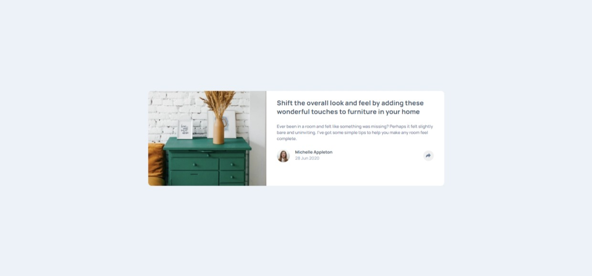

# Frontend Mentor - Article preview component solution

This is a solution to the [Article preview component challenge on Frontend Mentor](https://www.frontendmentor.io/challenges/article-preview-component-dYBN_pYFT). Frontend Mentor challenges help you improve your coding skills by building realistic projects.

## Table of contents

- [Overview](#overview)
  - [The challenge](#the-challenge)
  - [Screenshot](#screenshot)
  - [Links](#links)
- [My process](#my-process)
  - [Built with](#built-with)
  - [What I learned](#what-i-learned)
  - [Continued development](#continued-development)
  - [Useful resources](#useful-resources)
  - [AI Collaboration](#ai-collaboration)
- [Author](#author)
- [Acknowledgments](#acknowledgments)

## Overview

### The challenge

Users should be able to:

- View the optimal layout for the component depending on their device's screen size
- See the social media share links when they click the share icon

### Screenshot



### Links

- Solution URL: (https://github.com/ChasingCloudss/Article-Preview-Component)
- Live Site URL: (https://eloquent-melba-8fe147.netlify.app/)

## My process

### Built with

- Semantic HTML5 markup
- CSS custom properties
- Flexbox
- Mobile-first workflow

### What I learned

-Image Sizing Issue
My image was not spanning the full height of its container on both the tablet and desktop screens. To solve this issue, I specified the width of the image container `hero-image` to 40% and set the height value of the image to 100%. I also set the `object-fit` property of the image to `cover` so the parts that cannot be rendered get cropped out.

Popup Positioning Issue
On both the tablet and desktop screens, my popup was not positioned directly above the share-button when hovered on. To fix this I made the popup a sibling of the share-button and made their parent element a flex container to position them in a column form.

```css
.share-wrapper {
  display: flex;
  flex-direction: column;
  justify-content: center;
  align-items: center;
}

.share-panel {
  position: absolute;
  top: -145%;
  width: auto;
  z-index: 1;
  border-radius: 10px;
  background-color: var(--grey-900);
  padding: 14px 20px;
}
```

```js
articleFooter.addEventListener("mouseenter", function () {
  if (window.matchMedia("(min-width: 580px)").matches) {
    closeBtn.classList.add("hidden");
    openBtn.parentElement.appendChild(sharePanel);
    sharePanel.classList.remove("hidden");
  }
});

articleFooter.addEventListener("mouseleave", function () {
  if (window.matchMedia("(min-width: 580px)").matches) {
    closeBtn.classList.remove("hidden");
    footerSection.appendChild(sharePanel);
    sharePanel.classList.add("hidden");
  }
});
```

### AI Collaboration

I used ChatGPT, to fix my image sizing issue. I wrote the solution in the [###What I learned section]

## Author

- Frontend Mentor - [@ChasingCloudss](https://www.frontendmentor.io/profile/ChasingCloudss)
